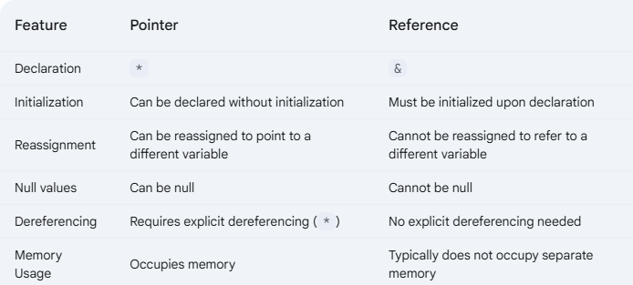

# CPP-Dojo
This repository is designed to help us efficiently learn the minimum C++ concepts required for a C++ coding interview.

  

## Syntax and Fundamentals
- Input/Output: cin, cout, and formatted output (printf, scanf).

## Pointers and References
- Pointer arithmetic, null pointers, double pointers.
- References and the difference between pointers and references.

## Memory Management
- Stack vs. heap memory.
- new, delete, smart pointers (unique_ptr, shared_ptr, weak_ptr).
- Avoiding memory leaks and dangling pointers.

## Object-Oriented Programming (OOP)
- Classes, constructors/destructors, member functions.
- Inheritance, polymorphism (virtual functions), and encapsulation.
- Operator overloading and friend functions.

## Templates
- Function and class templates.
- Template specialization and type deduction.

## C++ Standard Library (STL)
- Containers: vector, deque, list, map, unordered_map, set, priority_queue.
- Iterators: Understanding types of iterators and their use.
- Algorithms: sort, binary_search, lower_bound, upper_bound, find.
- Utility Functions: pair, tuple, make_pair, tie, std::move.

## Modern C++ Features (C++11 and Beyond)
- auto, decltype, nullptr, range-based loops.
- Lambda expressions and std::function.
- Move semantics and std::move.
- std::optional, std::variant, std::any.
